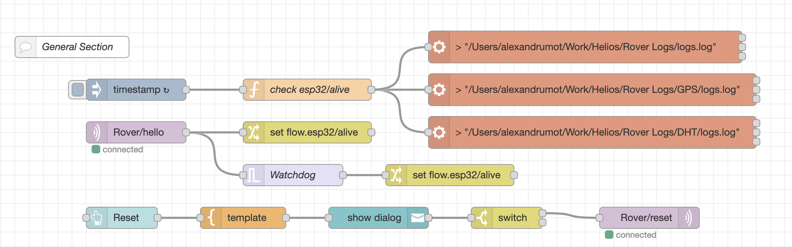
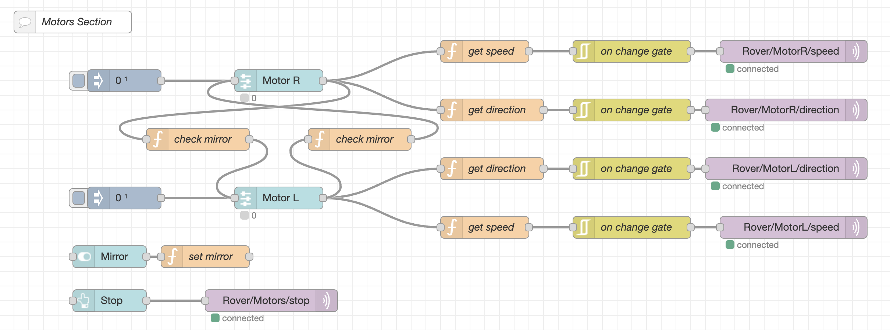
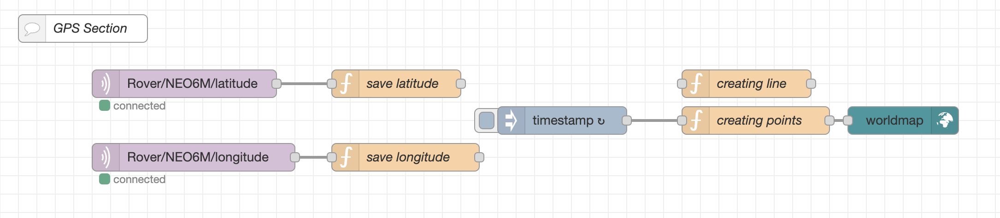
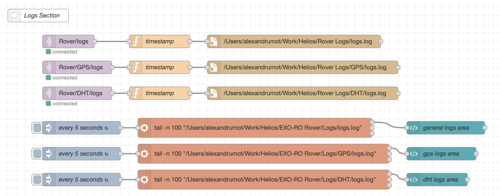
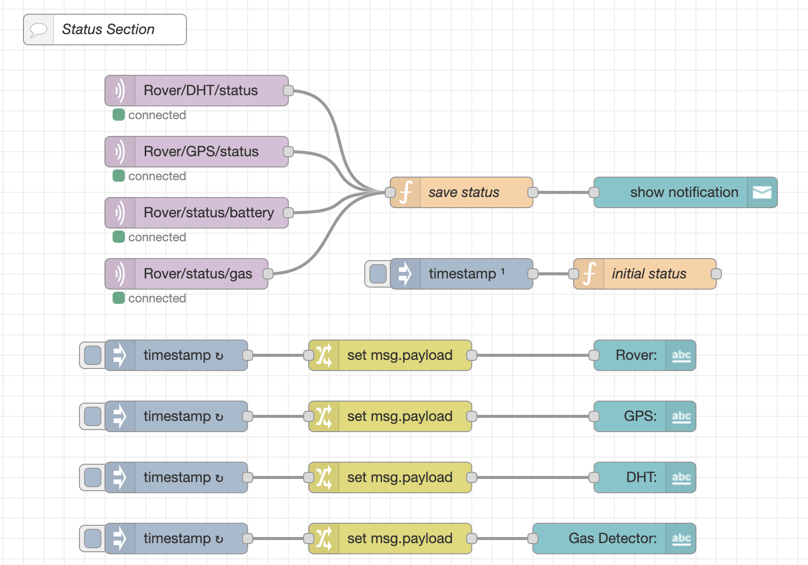
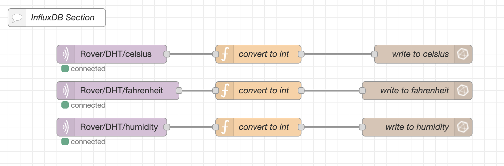

# Rover
## General Section

### IsAlive Watchdog
Waits for hello message from ESP32 and updates state accordingly.
### Reset Button
Sends a reset signal when pressed.

## Motors Section

Both DC motors are controlled individually with 2 sliders. After I configured the speed control I added a mirror and stop option.

## GPS Section

With the help of web-worldmap lib I was able to display the current location using my coordinates as input.

## Logs Section

Almost every log I got on the ESP32 I tried to replicate on the Node-Red end. This is crucial in case something in the rover breaks.

## Status Section

On/Off status on sensors and battery.

## InfluxDB Section

This section routes sensor logs to InfluxDB server. All data analysis will happen there.

## Libraries Used
- node-red-dashboard
- node-red-contrib-influxdb
- node-red-contrib-web-worldmap